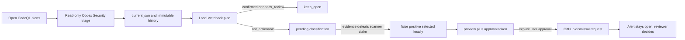

# How `triage-codeql-and-store` handles false positives and confirmed findings

This walkthrough explains the current repository-local skill and its writeback
script. The central rule is that a triage **verdict** and a GitHub **dismissal
reason** are different things. `confirmed` is a triage verdict. `false positive`
is a GitHub dismissal reason that can be selected only for a finding already
triaged as `not_actionable`.

## End-to-end flow

The skill first imports open alerts and performs a read-only static triage. It
must retain one result per alert and preserve the GitHub identity, branch, and
commit evidence. No code or GitHub state may change during this phase.
[[.agents/skills/triage-codeql-and-store/SKILL.md:30-45]]

The persistence script accepts exactly three verdict values:
`confirmed`, `needs_review`, and `not_actionable`.
[[.agents/skills/triage-codeql-and-store/scripts/persist_triage.py:19-21]] It
writes the validated payload to both `current.json` and a timestamped history
file, verifies both copies, and reports verdict counts without modifying
GitHub. [[.agents/skills/triage-codeql-and-store/scripts/persist_triage.py:203-239]]

## What happens to a confirmed finding

The mapping is fixed: a `confirmed` alert is assigned `keep_open`; it is not a
dismissal candidate. The same rule applies to `needs_review`.
[[.agents/skills/triage-codeql-and-store/SKILL.md:86-107]]

The plan builder enforces that mapping mechanically. It creates `pending` only
for `not_actionable`; every other verdict receives `keep_open`, `selected:
false`, and no dismissal reason or comment.
[[.agents/skills/triage-codeql-and-store/scripts/codeql_writeback.py:185-215]]

Plan validation prevents later tampering: a `confirmed` item must remain
unselected with action `keep_open`, and it cannot acquire a dismissal reason.
[[.agents/skills/triage-codeql-and-store/scripts/codeql_writeback.py:267-281]]

Therefore this skill does **not** update a confirmed alert on GitHub. The normal
next action is to hand it to `codex-security:fix-finding`, revalidate it against
the current checkout, implement and test a minimal fix, then rerun CodeQL on the
fixed revision. If the behavior is an intentional Juice Shop vulnerability,
that fact alone is insufficient to dismiss it; repository evidence or an
explicit maintainer decision is required.
[[.agents/skills/triage-codeql-and-store/SKILL.md:111-120]]

## What “false positive” means in this workflow

`false positive` is not another triage verdict. It is one of three allowed
GitHub dismissal reasons, alongside `used in tests` and `won't fix`.
[[.agents/skills/triage-codeql-and-store/scripts/codeql_writeback.py:20-25]]

Before selection, the agent must classify each `not_actionable` finding using
evidence. `false positive` means the scanner's technical claim is defeated by
the static evidence. Uncertain cases stay `pending`.
[[.agents/skills/triage-codeql-and-store/SKILL.md:109-136]]

Running `select` changes only the local plan. The script rejects any alert whose
triage verdict is not `not_actionable`; for an eligible alert it records
`request_dismissal`, the chosen reason, and an evidence-bearing comment.
[[.agents/skills/triage-codeql-and-store/scripts/codeql_writeback.py:361-388]]

This means a finding cannot remain `confirmed` and simultaneously be selected
as a false positive. If the scanner claim is actually incorrect, the triage
evidence should support `not_actionable`; if the claim is valid and reachable,
the finding remains `confirmed` and must stay open for remediation.

## Preview and approval gate

`preview` validates the entire plan, hashes its exact bytes into an approval
token, and prints every proposed PATCH body. Each body contains
`create_request: true`, so the operation creates a reviewer-controlled request
rather than directly dismissing the alert.
[[.agents/skills/triage-codeql-and-store/scripts/codeql_writeback.py:392-429]]

The skill must then pause and ask the user to approve the exact alert numbers
and approval token. An earlier or modified plan has a different token and is
not approved. [[.agents/skills/triage-codeql-and-store/SKILL.md:150-168]]

## Apply, readback, and final state

Before any write, `apply` recalculates the plan hash and rejects a mismatched
approval token. It then runs preflight for every selected alert.
[[.agents/skills/triage-codeql-and-store/scripts/codeql_writeback.py:690-701]]

Preflight verifies the alert identity and URL, requires the alert to be open,
checks for conflicting dismissal requests, and proves that an instance exists
on the requested branch. [[.agents/skills/triage-codeql-and-store/scripts/codeql_writeback.py:586-671]]

For a newly selected false positive, the script sends the approved PATCH with
`create_request: true`, reads back both the alert and its dismissal request,
and fails unless the alert is still open and the request matches the approved
reason and comment. It then persists current and historical receipts.
[[.agents/skills/triage-codeql-and-store/scripts/codeql_writeback.py:716-776]]

The immediate state after a successful apply is therefore:

| Triage result | Local plan | GitHub operation | Immediate GitHub state |
|---|---|---|---|
| `confirmed` | `keep_open` | None | Alert remains open |
| `needs_review` | `keep_open` | None | Alert remains open |
| `not_actionable` + `false positive` | `request_dismissal` | Approval-gated dismissal request | Alert open; request open |
| `not_actionable` without enough evidence | `pending` | None | Alert remains open |

An independent GitHub reviewer must approve or deny the request. This workflow
never performs that reviewer decision and never directly dismisses an alert.
[[.agents/skills/triage-codeql-and-store/SKILL.md:170-208]]

## Practical decision rule

Use these questions in order:

1. Is the CodeQL source-to-sink claim technically wrong? Record
   `not_actionable`, classify it as `false positive`, preview, and seek explicit
   approval for a dismissal request.
2. Is the claim technically valid and reachable? Keep it `confirmed`, leave the
   alert open, and use `fix-finding` to remediate it.
3. Is the behavior valid but explicitly accepted as an intentional training
   vulnerability? Only with repository evidence or a maintainer decision,
   classify the `not_actionable` result as `won't fix`; do not call it a false
   positive.
4. Is the evidence incomplete? Use `needs_review` or leave the disposition
   `pending`; do not send a GitHub write.

The hard rules prohibit dismissing `confirmed` or `needs_review` alerts,
skipping approval, using direct dismissal, or inventing a dismissal reason
without evidence. [[.agents/skills/triage-codeql-and-store/SKILL.md:203-212]]
