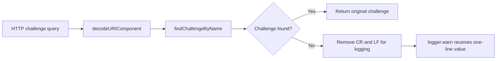

# Regression Test Validation Report: GitHub CodeQL Alert 46

This report explains what the regression tests validate for the `js/log-injection`
patch in `lib/challengeUtils.ts`, how each assertion detects the original defect,
and what evidence establishes that the patch succeeds.

## Executive Summary

**Finding:** GitHub CodeQL alert 46 reported that an attacker-controlled challenge
name could insert carriage-return or newline characters into a warning log entry.

**Security invariant:** A missing challenge name may be logged, but the value passed
to `logger.warn` must not contain `\r` or `\n`. One request must therefore remain one
physical log record.

**Result:** The focused unit test passed **3/3** and the route-level API test passed
**4/4**, both with exit code `0`. The regression was also exercised before the patch;
the malicious case failed because the captured log argument still contained CR/LF.
That before/after result demonstrates that the test is sensitive to the vulnerable
behavior and becomes green because of the patch.

## Vulnerable Data Flow and Patch Boundary

The application registers an unauthenticated `GET /rest/repeat-notification`
endpoint in [[server.ts:608-608]]. The handler decodes the attacker-controlled
`challenge` query value and passes it to `findChallengeByName`
[[routes/repeatNotification.ts:9-12]].

When no challenge matches, `findChallengeByName` reaches the warning-log sink. The
patch removes CR and LF characters only at that sink
[[lib/challengeUtils.ts:93-100]]. The original `challengeName` is still used for the
lookup, so the fix does not alter which challenge is found.



## What the Unit Regression Test Validates

The unit test replaces `logger.warn` with a mock, invokes `findChallengeByName`
directly, and inspects the exact arguments captured by that mock. It exercises four
attacker-input classes: LF, CR, CRLF, and repeated LF. Every lookup must still return
`undefined`, and every captured log argument must fail to match `/[\r\n]/`
[[test/server/challengeUtils.unit.test.ts:43-57]].

This establishes two properties:

1. Missing challenge behavior is preserved: the function still returns `undefined`.
2. Log-record injection is blocked: neither CR nor LF reaches the logger.

A separate compatibility assertion verifies that an ordinary missing name is still
logged with the exact original message
[[test/server/challengeUtils.unit.test.ts:31-41]]. An existing challenge is also
still returned normally [[test/server/challengeUtils.unit.test.ts:59-61]].

### Why the unit assertion fails without the patch

Before the patch, the mock captured a value equivalent to:

```text
Missing challenge with name: missing\r\nforged log entry
```

Because that value matches `/[\r\n]/`, `assert.doesNotMatch` fails. With the patch,
the logger receives the one-line equivalent `Missing challenge with name:
missingforged log entry`, so the assertion passes.

## What the API Regression Test Validates

The API test sends `%0D%0A`, the URL-encoded form of CRLF, through the real endpoint
instead of calling the utility directly. It mocks the logger, performs the request,
requires HTTP status `200`, and checks that the captured log argument contains no CR
or LF [[test/api/repeat-notification.test.ts:37-51]].

This proves the mitigation holds across the complete relevant path:

1. Supertest sends the malicious query string.
2. Express supplies it to the route.
3. `decodeURIComponent` produces the CRLF-containing challenge name.
4. `findChallengeByName` reaches the missing-challenge warning.
5. The logger mock captures the final value after sanitization.
6. The test fails unless the response remains `200` and the captured value is one line.

The surrounding API tests preserve the legitimate contract for requests without a
challenge, with an unsolved challenge, and with a solved challenge
[[test/api/repeat-notification.test.ts:22-35]]
[[test/api/repeat-notification.test.ts:53-59]].

## How the Tests Determine That the Patch Succeeded

The tests do not infer success from the implementation text. They observe the value
at the security-sensitive boundary: the argument actually passed to `logger.warn`.

| Success criterion | Assertion and evidence | Failure signal |
| --- | --- | --- |
| CR/LF cannot reach the log sink | `assert.doesNotMatch(logArgument, /[\r\n]/)` | Any CR or LF causes an assertion failure |
| Missing-name behavior remains | Result equals `undefined` | Changed lookup behavior causes an assertion failure |
| Normal log text remains | Safe log argument equals the original expected message | Unnecessary modification causes an assertion failure |
| Existing lookup remains | Known challenge object is returned | Lookup regression causes an assertion failure |
| HTTP behavior remains | Response status equals `200` | Route behavior change causes an assertion failure |
| Real route reaches the sink | API test reads the first captured mock call | Missing log call or bad argument causes the test to fail |

The key evidence is the combination of **negative proof** (no captured log value
contains CR/LF) and **compatibility proof** (lookup results, safe log text, and HTTP
status are unchanged).

## Recorded Test Results

Focused unit regression run:

```text
tests 3
pass 3
fail 0
exit code 0
```

Isolated route-level API regression run:

```text
tests 4
pass 4
fail 0
exit code 0
```

The API test was run from the isolated validation copy because the OneDrive-backed
sandbox can exhaust its file-watcher allowance after the assertions finish. In the
workspace run, all four API assertions passed before that unrelated `EMFILE` watcher
error. The isolated run removed that environmental noise and completed cleanly with
exit code `0`.

## Coverage Limits

The regression tests prove closure of the reported CodeQL condition for CR and LF,
including encoded CRLF through the real HTTP route. They do not claim that every
possible Unicode line-separator convention is normalized; that is outside the
specific `js/log-injection` data flow tested here. GitHub CodeQL should still be
rerun after the patch is pushed to confirm alert 46 is closed in the analyzed commit.

## Conclusion

The regression test knows the patch succeeds because the same attacker-controlled
value that previously reached `logger.warn` with embedded line breaks is now captured
without CR/LF, while all checked legitimate behavior remains unchanged. The passing
unit and API layers jointly validate both the narrow sink fix and its real endpoint
integration.
